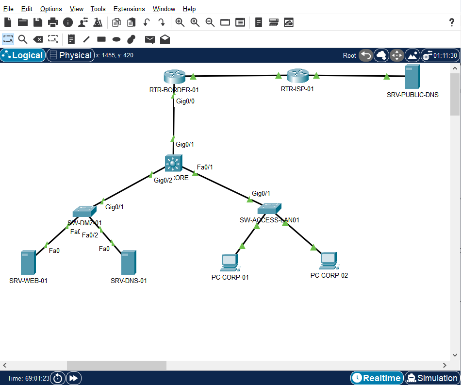
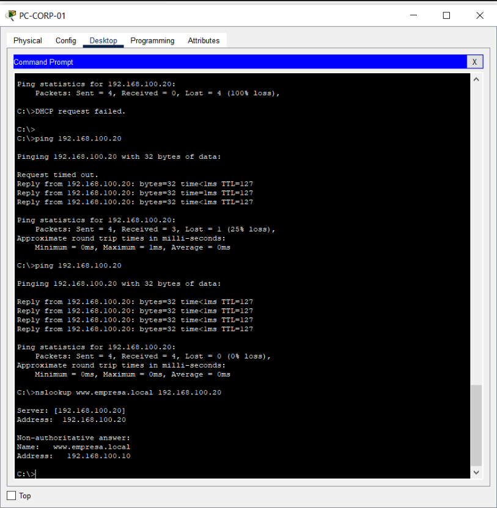
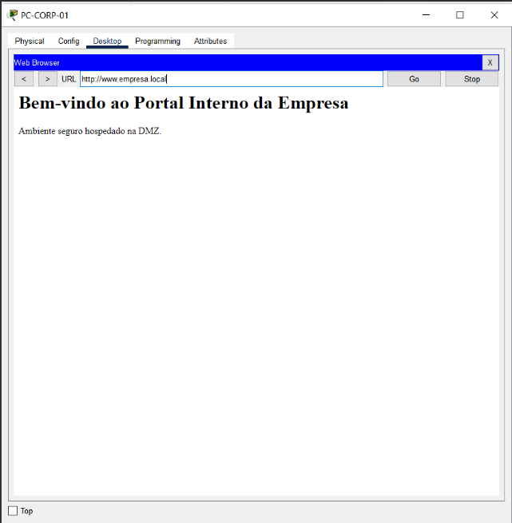

# 🌐 Infraestrutura de Rede Corporativa com DMZ e Troubleshooting DNS

Projetação, implementação e diagnóstico de falhas em uma infraestrutura de rede corporativa segmentada (LAN + DMZ) desenvolvida no **Cisco Packet Tracer**. O projeto foca em roteamento de Camada 3 (Inter-VLAN), segmentação de segurança e resolução de nomes (DNS Tipo A) para acesso a serviços web internos.

---

## 🛠️ Arquitetura e Topologia da Rede

A topologia foi desenhada em uma estrutura hierárquica contendo rede local de clientes, switch core de distribuição L3, switch de acesso e servidores dedicados na DMZ.

### Tabela de Endereçamento e Interfaces

| Dispositivo | Interface | Endereço IP | Máscara de Sub-rede | Gateway Padrão | Função |
| :--- | :--- | :--- | :--- | :--- | :--- |
| **PC-CORP-01** | FastEthernet0 | `10.10.20.100` | `255.255.255.0` | `10.10.20.1` | Estação de trabalho corporativa |
| **SW-CORE-01** | Vlan10 (SVI) | `10.10.20.1` | `255.255.255.0` | N/A | Gateway L3 da LAN Corporativa |
| **SW-CORE-01** | Vlan1 (SVI) | `192.168.100.1` | `255.255.255.0` | N/A | Gateway L3 da DMZ |
| **SRV-DNS-01** | FastEthernet0 | `192.168.100.20` | `255.255.255.0` | `192.168.100.1` | Servidor DNS Primário |
| **SRV-WEB-01** | FastEthernet0 | `192.168.100.10` | `255.255.255.0` | `192.168.100.1` | Servidor Web HTTP |

---

## ⚙️ Configurações Principais

### Roteamento Inter-VLAN no Switch Core (SW-CORE-01)

* **SW-CORE-01> enable**
* **SW-CORE-01# configure terminal**
* **SW-CORE-01(config)# ip routing**
* **SW-CORE-01(config)# interface Vlan1**
* **SW-CORE-01(config-if)# ip address 192.168.100.1 255.255.255.0**
* **SW-CORE-01(config-if)# no shutdown**
* **SW-CORE-01(config-if)# exit**
* **SW-CORE-01(config)# write memory**

---

## 🔍 Análise de Troubleshooting e Validações

### Diagnóstico de Causa Raiz
Inicialmente, os testes de consulta DNS (`nslookup www.empresa.local 192.168.100.20`) executados no **PC-CORP-01** apresentavam timeout. Por meio de testes com ICMP (`ping`), identificou-se que o host alcançava o gateway corporativo (`10.10.20.1`), porém a comunicação parava no switch core por falta da SVI configurada na sub-rede da DMZ (`192.168.100.0/24`).

### Validação de Conectividade e DNS
Após ativar o roteamento de Camada 3 (`ip routing`) e a interface `Vlan1` no `SW-CORE-01`, a resolução de nomes e a conectividade IP foram restabelecidas com sucesso:

### Acesso ao Portal Web via Nome de Domínio
Com a resolução DNS operacional, o acesso ao serviço HTTP via FQDN (`http://www.empresa.local`) foi validado através do Web Browser do host:

---

## 📝 Conclusão

A execução deste laboratório consolidou conceitos fundamentais de arquitetura de redes corporativas e resolução de problemas (troubleshooting):

1. **Segmentação e Roteamento:** A separação de redes entre estações de trabalho e serviços da DMZ garante controle de tráfego, sendo indispensável o roteamento Inter-VLAN (Camada 3) para habilitar a comunicação entre diferentes sub-redes.
2. **Dependência de Infraestrutura:** Foi demonstrado na prática como falhas na camada de conectividade IP (Camada 3) impactam diretamente a disponibilidade de serviços da Camada de Aplicação (DNS e HTTP).
3. **Metodologia de Diagnóstico:** O isolamento do problema com ferramentas nativas (`ping` para Camada 3 e `nslookup` para Camada 7) permitiu identificar rapidamente a ausência do gateway da DMZ, garantindo o restabelecimento do ambiente.

---

## 📁 Como Executar este Projeto

1. Faça o clone deste repositório ou baixe o arquivo `.pkt`:
   `git clone [https://github.com/thiago-root/projeto-cisco-troubleshooting-redes.git](https://github.com/thiago-root/projeto-cisco-troubleshooting-redes.git)`
2. Abra o arquivo `Projeto_DMZ_DNS_OK.pkt` utilizando o **Cisco Packet Tracer** (versão 8.0 ou superior).
3. Abra o terminal do `PC-CORP-01` e execute `nslookup www.empresa.local 192.168.100.20` para validar os testes.
